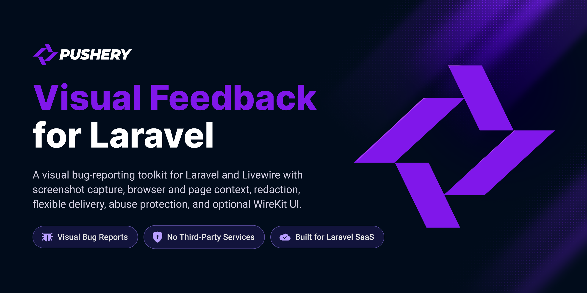

<p align="center">
  <a href="https://github.com/pushery/visual-feedback-for-laravel">
    
  </a>
</p>

# Visual Feedback for Laravel

[](https://packagist.org/packages/pushery/visual-feedback-for-laravel)
[](https://packagist.org/packages/pushery/visual-feedback-for-laravel)
[](https://packagist.org/packages/pushery/visual-feedback-for-laravel)
[](https://livewire.laravel.com)
[](LICENSE)

[](https://pestphp.com)


[](https://phpstan.org)
[](https://laravel.com/docs/pint)


In-page feedback widget with client-side screenshot capture for Laravel and Livewire.

Your users see the bug. This gets you the picture — plus the browser, the viewport,
the URL and the scroll position they were at — without asking them to explain any of it.

## Install

```bash
composer require pushery/visual-feedback-for-laravel
php artisan vendor:publish --tag=visual-feedback
```

Then place the widget once in your layout and point the mail channel somewhere —
`VISUAL_FEEDBACK_MAIL_TO` ships empty, and a report with nowhere to go still shows the
reporter a success screen. Needs PHP 8.4+, Laravel 12+ and Livewire 4.3+.

## What it does

- A Livewire widget in **modal or inline** mode — built-in floating button, standalone trigger,
  or a plain window event if you place your own.
- **Screenshot capture in two stages**: the browser's own screen capture where it exists,
  falling back silently to a DOM renderer that works everywhere, including iOS. The report
  records which stage produced the image.
- **Region redaction** that holds in *both* stages — the area is blacked out and input values
  cleared before anything is captured.
- **Two view trees** — framework-free, or WireKit components that inherit your design tokens.
- **Delivery channels**: mail, database and signed webhook, each isolated, individually queued,
  extensible with your own.
- **Abuse protection with no external service** — honeypot, server-anchored time trap and rate
  limits, running underneath any gate you add rather than instead of it, so a challenge provider
  being down can never leave the form unprotected. The honeypot and the time trap depend on
  nothing outside the request; the rate limits go through your cache, and what happens when that
  is down is a setting. The one deliberate off switch is `abuse.min_fill_seconds = 0`, which
  disarms the time trap — the value test suites reach for, and worth checking before it reaches
  a published config.
- Built to **WCAG 2.1 AA**, proven rather than asserted: a full axe sweep over every widget state
  in both trees, a keyboard-only run through the whole flow, and contrast measured on the values
  the browser actually rendered.

## Documentation

Full docs: **[docs.pushery.com/visual-feedback-for-laravel](https://docs.pushery.com/visual-feedback-for-laravel/)**

- [Installation](https://docs.pushery.com/visual-feedback-for-laravel/installation) — requirements, publish tags, where the widget goes
- [Configuration](https://docs.pushery.com/visual-feedback-for-laravel/configuration) — every config key and its environment variable
- [The capture cascade](https://docs.pushery.com/visual-feedback-for-laravel/capture) — the two stages, and which one produced a report
- [Placing the trigger](https://docs.pushery.com/visual-feedback-for-laravel/placing-the-trigger) — the built-in button, your own, or the window event
- [View trees](https://docs.pushery.com/visual-feedback-for-laravel/view-trees) — framework-free, or WireKit with your design tokens
- [Delivery channels](https://docs.pushery.com/visual-feedback-for-laravel/delivery-channels) — mail, database, signed webhook, and adding your own
- [Report browser](https://docs.pushery.com/visual-feedback-for-laravel/report-browser) — the optional view over
  the reports table: route it, open the gate
- [Abuse protection](https://docs.pushery.com/visual-feedback-for-laravel/abuse-protection) — what the floor covers on its own, and the seam for
  adding your own gate
- [Privacy and retention](https://docs.pushery.com/visual-feedback-for-laravel/privacy-and-retention) — the notice, and how long anything is kept
- [Accessibility](https://docs.pushery.com/visual-feedback-for-laravel/accessibility) — what is proven, and the three things your page owes
- [Integration contract](https://docs.pushery.com/visual-feedback-for-laravel/integration-contract) — CORS, CSP, and what the DOM stage does
  not reproduce
- [Testing](https://docs.pushery.com/visual-feedback-for-laravel/testing) — driving the widget from
  your own suite, and what the bundled suites already prove

## Third-party notices

The capture bundle includes [html2canvas-pro](https://github.com/yorickshan/html2canvas-pro) 2.4.1 (MIT).
The version is named so you can match an advisory against what you actually ship.

## Security

Please review the [security policy](SECURITY.md) and report vulnerabilities
privately rather than opening a public issue.

## Built by Pushery

This package is built and maintained by [Pushery](https://www.pushery.com) — a
Berlin-based studio building Laravel applications, SaaS products, and open-source
tools.

Building a Laravel UI? [WireKit](https://www.wirekit.app), Pushery's open-source
Livewire component kit, gives you a polished component library out of the box.
Browse the rest of our work at [pushery.com](https://www.pushery.com).

## License

The MIT License (MIT). See [LICENSE](LICENSE) for details.
